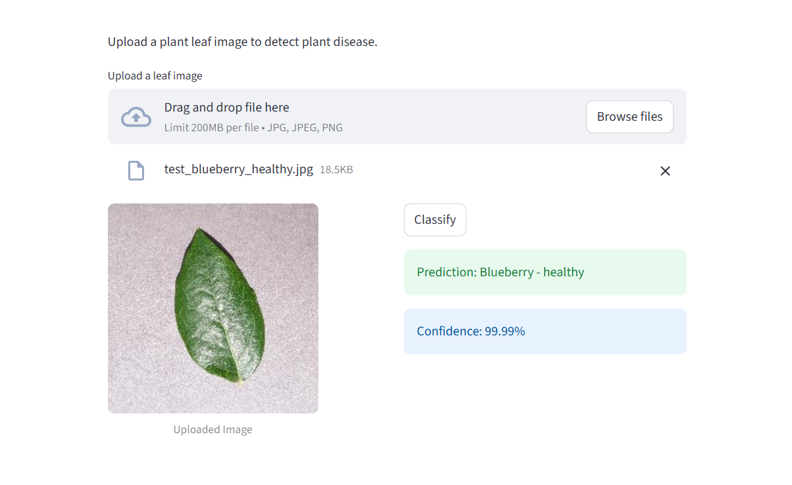

# plant-disease-prediction-cnn-deep-leanring-project

# 🌿 Plant Disease Detection using Deep Learning

A deep learning based web application that detects plant diseases from leaf images.  
The system uses a Convolutional Neural Network (CNN) trained on the **PlantVillage dataset** to classify plant diseases across **38 classes** with high accuracy.

---

# 🚀 Live Demo

🔗 **Application:**  
https://plant-diseases-detection-8xlw.onrender.com

---

# 💻 GitHub Repository

🔗 **Source Code:**  
https://github.com/sudhanshu2027/plant-diseases-detection

---

# 📸 Demo

Upload a plant leaf image and the model predicts the disease in real time.



---

# 📌 Features

- 🌱 Detects plant diseases from leaf images
- 🧠 Deep Learning based classification
- 📊 Supports **38 plant disease categories**
- ⚡ Fast prediction using trained CNN model
- 🌐 User-friendly web interface using **Streamlit**
- 📈 High accuracy model for disease detection

---

# 🧠 Model Details

| Parameter | Value |
|-----------|------|
Model Type | Convolutional Neural Network (CNN)
Framework | TensorFlow / Keras
Optimizer | Adam
Training Accuracy | **97%**
Validation Accuracy | **96.5%**
Dataset | PlantVillage Dataset
Classes | 38

---

# 🛠️ Tech Stack

### Machine Learning / Deep Learning
- Python
- TensorFlow
- Keras
- NumPy
- Pillow

### Web Application
- Streamlit

---

## 📂 Project Structure

```text
plant-diseases-detection
│
├── assets
│   └── demo.png
│
├── app
│   ├── main.py
│   ├── class_indices.json
│   ├── requirements.txt
│   └── trained_model
│        └── plant_disease_prediction_model1.h5
│
├── model_training_notebook
│   └── plant_disease_detection.ipynb
│
├── test_images
│
│
├── README.md
└── .gitignore
```

---

# 🧪 Dataset

The model was trained using the **PlantVillage dataset**.

---

# ⚙️ Installation

Clone the repository

```bash
git clone https://github.com/sudhanshu2027/plant-diseases-detection.git
cd plant-diseases-detection
```

Install dependencies

```bash
pip install -r requirements.txt
```

Run the application

```bash
streamlit run main.py
```

---

# 🖼️ How It Works

1️⃣ Upload a plant leaf image  
2️⃣ Image preprocessing is applied  
3️⃣ The trained CNN model predicts the disease  
4️⃣ The predicted class is displayed

---

# 👨‍💻 Author

**Sudhanshu Kumar**

GitHub  
https://github.com/sudhanshu2027

LinkedIn  
https://www.linkedin.com/in/sudhanshu2027/

---

